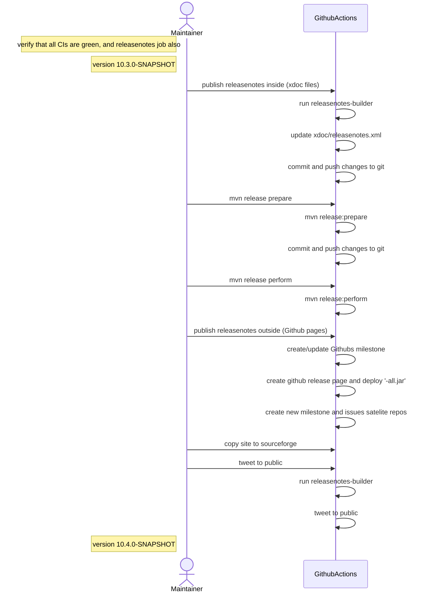

# Flow chart when user play need to do preparation for release

[Mermaid syntax](https://mermaid-js.github.io/mermaid/#/sequenceDiagram).

```mermaid
sequenceDiagram
    actor Maintainer
    participant GithubActions

    Note left of Maintainer: verify that all CIs are green, and releasenotes job also
    
    Note left of Maintainer: version 10.3.0-SNAPSHOT
    Maintainer->>GithubActions: publish releasenotes inside (xdoc files)

    GithubActions->>GithubActions: run releasenotes-builder
    GithubActions->>GithubActions: update xdoc/releasenotes.xml
    GithubActions->>GithubActions: commit and push changes to git
    
    Maintainer->>GithubActions: mvn release prepare
    GithubActions->>GithubActions: mvn release:prepare
    GithubActions->>GithubActions: commit and push changes to git

    Maintainer->>GithubActions: mvn release perform
    GithubActions->>GithubActions: mvn release:perform

    Maintainer->>GithubActions: publish releasenotes outside (Github pages)
    GithubActions->>GithubActions: create/update Githubs milestone
    GithubActions->>GithubActions: create github release page and deploy '-all.jar'
    GithubActions->>GithubActions: create new milestone and issues satelite repos

    Maintainer->>GithubActions: copy site to sourceforge

    Maintainer->>GithubActions: tweet to public
    GithubActions->>GithubActions: run releasenotes-builder
    GithubActions->>GithubActions: tweet to public
    
    Note left of Maintainer: version 10.4.0-SNAPSHOT
```
