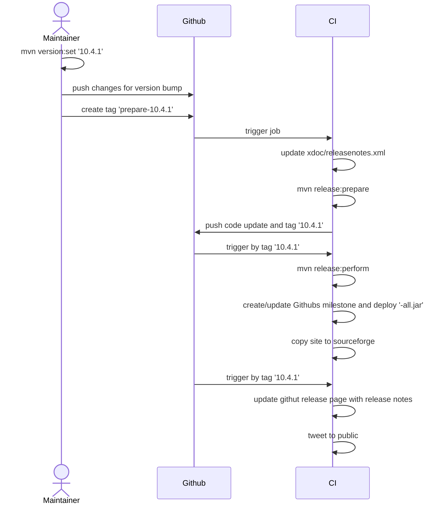

Flow chart when user play need to do preparation for relase:

```mermaid
sequenceDiagram
    actor Maintainer
    participant Github
    participant CI
    Maintainer->>Maintainer: mvn version:set '10.4.1'
    Maintainer->>Github: push changes for version bump
    Maintainer->>Github: create tag 'prepare-10.4.1'
    Github->>CI: trigger job
    CI->>CI: update xdoc/releasenotes.xml
    CI->>CI: mvn release:prepare
    CI->>Github: push code update and tag '10.4.1'
    
    Github->>CI: trigger by tag '10.4.1'
    CI->>CI: mvn release:perform
    CI->>CI: create/update Githubs milestone and deploy '-all.jar' 
    CI->>CI: copy site to sourceforge

    Github->>CI: trigger by tag '10.4.1'
    CI->>CI: update githut release page with release notes
    CI->>CI: tweet to public

```
